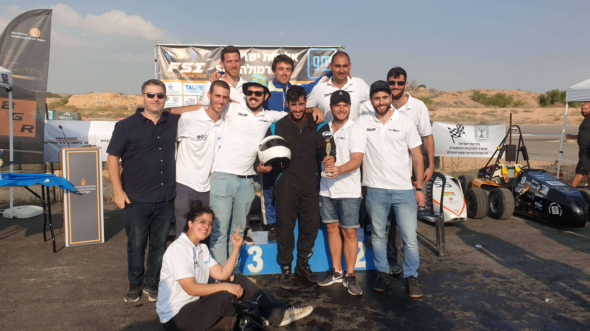

### Role Summary

- 🧠 Designed and programmed the **main control board**: power, kill switch logic, telemetry, and throttle control.
- 📡 Developed a **CAN-based telemetry system** and wireless RF interface for real-time performance monitoring.
- 🛠️ Coordinated **track-side testing**, failure debugging, and on-the-fly logic updates with the team.

---

### 📸 Media Highlights

#### 🏎️ Car in Action

<video controls width="100%">
  <source src="car_action.mp4" type="video/mp4">
  Your browser does not support the video tag.
</video>

#### 🧑‍🤝‍🧑 Team Photo

#### 🚗 The Car

